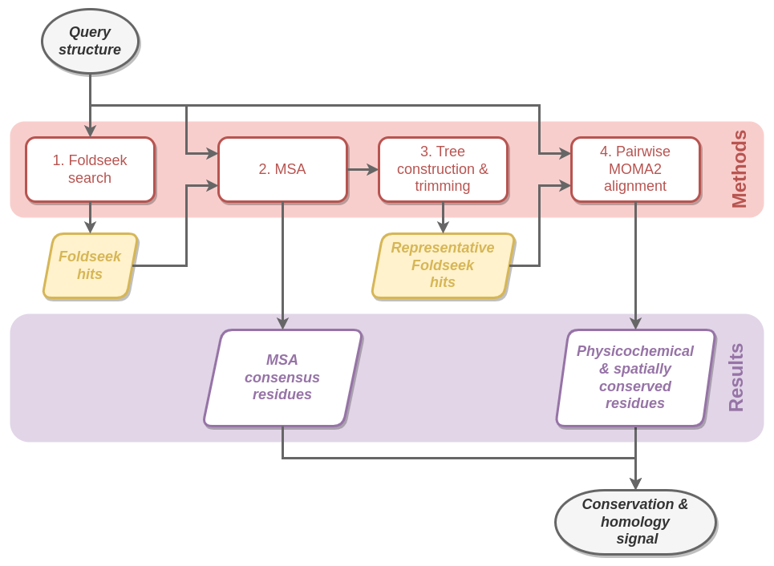

# ResidueFisher

`ResidueFisher` is a bioinformatics protocol for the search of protein homology using a three-step ”search, detect, and enrich” model that uses a combination of structural and sequence aligners working in tandem to filter and enrich conservation signals, resulting in "fished" residues that may shed light into understanding ans studying a protein of interest.



## Table of Contents

- [Dependencies](#dependencies)
- [Installation](#installation)
- [Usage](#usage)
- [Support](#support)
- [Contributing](#contributing)

## Dependencies

`ResidueFisher` depends on:
- bash
- conda
- docker
- mafft
- tmux

## Installation

To install `ResidueFisher`, run the following code snippet:
```sh
git clone https://github.com/cvigilv/ResidueFisher
cd ResidueFisher
make configure
conda activate ResidueFisher
```
In order to use `ResidueFisher`, que conda environment must be active (`conda activate ResidueFisher`)

## Usage
### Database preparation

To prepare a database using Foldseek, run the script `bin/prep_database.sh` script as follows:

```sh
sh bin/prep_database.sh <FOLDSEEK-DATABASE-NAME> <INTERNAL-DATABASE-NAME>

# Example preparation of PDB dataset available in Foldseek
sh bin/prep_database.sh PDB mypdb
```
To see the available datasets, run `bin/prep_database.sh` without arguments.

To prepare a database from PDB files, please refer to [foldseek tutorial](https://github.com/steineggerlab/foldseek#databases). In order for `ResidueFisher` to work correctly, user created databases must be inside a directory named `data/foldseek_dbs` in the proyect root and must contain FASTA files for the aminoacid sequence and 3di sequence, which can be generated as follows:
```sh
foldseek convert2fasta <USER-DB-NAME> <USER-DB-NAME>.fasta
foldseek lndb <USER-DB-NAME>_h <USER-DB-NAME>_ss_h
foldseek convert2fasta <USER-DB-NAME>_ss <USER-DB-NAME>_ss.fasta
```

### Query protein preparation
Unlike Foldseek, this protocol is intended to study a single protein chain; therefore, in order to use `ResidueFisher`, one must first extract a chain of interest from its original PDB file.

In the `src/scripts` folder, there is a script called `splitchains.py`, which extracts all the chains from a particular PDB file and saves them as separate files for use in `ResidueFisher`.

*Note*: the recommended way of preparing and storing all the structure files is creating a new folder in data called `queries` (due to the nature of this files) and run the chain splitting script inside this folder. Here is an example of this procedure:

```sh
# Ensure we have the conda environment activated 
conda activate ResidueFisher

# Assuming you are at the project root...
mkdir data/queries
cd data/queries
wget https://files.rcsb.org/download/3F3P.pdb
python ../../src/scripts/splitchains.py 3F3P.pdb
```
From this example, a total of 13 should be found inside the `data/queries` folder: 1 for the original structure and 12 corresponding to the chains A through L of 3F3P.


### Foldseek-fishing Usage

To use ResidueFisher, run the script `bin/ResidueFisher` script as follows:
```sh
sh bin/ResidueFisher <PDB-FILE> <INTERNAL-DATABASE-NAME>

# Example using the previously prepared protein and dataset
sh bin/ResidueFisher data/queries/3F3P_C.pdb mypdb
```

This will generate a folder in `results` with the following structure:
```
results/3F3PC_pdb/
├── foldseek/
├── msa/
├── moma/
└── tree/
```

Inside each subdirectory, log files and result can be found in order to analyse and study the protein used in the protocol.

## Support

Please [open an issue](https://github.com/cvigilv/ResidueFisher/issues/new) for
support.

## Contributing

Please contribute using [Github Flow](https://guides.github.com/introduction/flow/). Create a branch, add
commits, and [open a pull request](https://github.com/cvigilv/ResidueFisher/compare/).

## License

MIT

