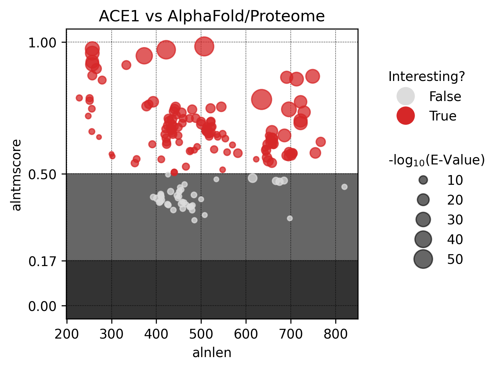
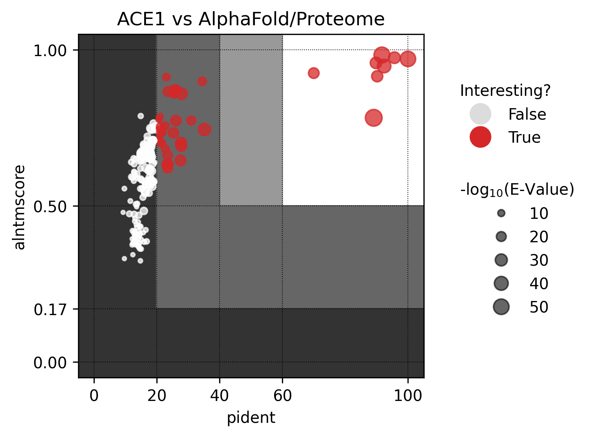
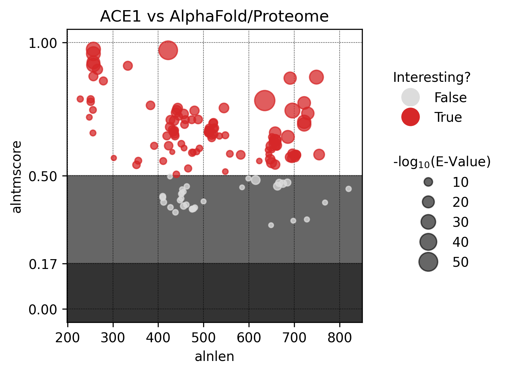
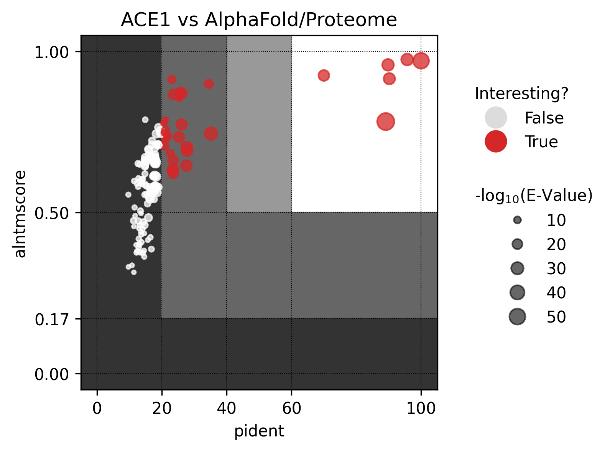

# 2022-09-22

- [X] Lectura de paper de Foldseek [[kempen2022]]
- [X] Lectura del capitulo de MCs [[plantomycetes_cell_structure_origins_and_biology_2013]]

# 2022-09-23

- [X] Instalación de docker
- [X] Instalación de MOMA2
- [X] Probar MOMA2
- [X] Instalar Foldseek
- [X] Probar Foldseek
- Se tuvo que agregar al user `carlos` al grupo `docker` para uso de `docker` sin `root`
- Se crea un script de `tmux` para automáticamente motar el `docker-image` de MOMA2, abrir la
carpeta de REFRACT y abrir `vim` con el Zettelkasten de REFRACT
- Se crea un `conda-env` nuevo llamado `foldseek` para Foldseek
- Se descargaron las estructuras PDB de algunos MCs para probar Foldseek y MOMA2, basandose
en [10.1371/journal.pbio.1000281](https://doi.org/10.1371/journal.pbio.1000281):
> ... 3hxr and 3f7f, Nup120; 1xks and 3i4r, Nup133; 3i5p, Nup170; 1bpo and 1b89, clathrin;
and 2pm6 and 2pm9, Sec31. ...

# 2022-09-26

- [X] Implementar comparación all-vs-all MOMA
- [X] Enviar mail a Fernando Gutiérrez por dudas de MOMA y de base de datos de validación paper
- Fernando me indico que MOMA2 solo puede realizar comparaciones estructurales entre cadenas
de 2 estructuras, por lo que hay que implementar el all-vs-all con un script de Python o bash.
- Se implementa un acumulador de todas las salidas de MOMA2, así generando un CSV con la
información necesaria para seleccionar y revisar alguno casos en particular.

# 2022-09-27

- [X] Implementar alineamiento estructural pairwise con Foldseek
- Alineamiento no funciona en todos los casos, al parecer hay un error en las traslaciones ya
que las rotaciones de la estructura están correctas.

# 2022-09-28

- Implemente un pequeño notebook para analizar los alineamientos de MOMA2

# 2022-09-29

- [X] Terminar notebook de analisis de alineamientos MOMA2
- [X] Iniciar implementacion de validacion MOMA2
- Se tuvo que descargar todas las estructuras del dataset de validacion de MOMA por que estaban
separadas por cadena (no funciona con `MOMA2_pw.py`)

# 2022-09-30

- [X] Descargar estructuras para validacion MOMA2
- [X] All-vs-All Foldseek
- [!] Hibrido MOMA - Foldseek: Extraccion de dominion a alinear con MOMA y alineamiento con
Foldseek para velocidad. Probar con nucleoporina (COPII y Nic96, ultima figura paper MOMA)
¿MOMAseek?

# 2022-10-04

- [X] Propuesta de ejemplo para probar MOMAseek
- [X] Alineamiento de ejemplo con Foldseek
- [X] Alineamiento de ejemplo con MOMA2
- Como ejemplo para probar MOMA2 versus Foldseek para el alineamiento de repeat domains se
utilizaron las estructuras de Sec31 de COPII (PDB code 2QX5) y la nucleoporina Nic96 (PDB
code 2PM7).

# 2022-10-14

- [!] Probar (1) busqueda con Foldseek y (2) refinamiento con MOMA
- [!] Probar (1) Deteccion de bloques con MOMA, (2) busqueda con Foldseek y (3) refinamiento con MOMA
- Usar como ejemplo https://www.ncbi.nlm.nih.gov/pmc/articles/PMC2680690/

# 2022-10-18

- [.] Preparar ACE1 proteins, dividiendolas en "crown", "trunk" y "tail"
- [.] Foldseek ACE1 modules (all vs AlphaFold)
- [.] MOMA2 ACE1 proteins (all vs all)

# 2022-10-19

- Se empieza a hacer una busqueda masiva de ACE1 con Foldseek sobre las bases de datos `Proteome` y `PBD`
de AlphaFold.

~~~ bash
foldseek search ACE1_v20221019 pdb ../foldseek/ACE1_3di_pdb/aln /tmp -e inf -s 500 --tmscore-threshold 0 -a
foldseek convertalis ACE1_v20221019 pdb ../foldseek/ACE1_3di_pdb/aln ../foldseek/ACE1_3di_pdb/aln.tsv --format-output query,target,pident,alnlen,mismatch,gapopen,qstart,qend,tstart,tend,evalue,bits,qlen,tlen,qaln,taln,qca,tca,qseq,tseq,taxid,taxname,alntmscore,u,t
~~~

# 2022-10-20

- Al correr convertalis, basta con pedir las `u`, `t` y `alntmscore` para que calcule TMalign,
por lo que se puede bypassear el commando `foldseek aln2tmscore`

# 2022-10-24

- [X] Implementar realineamiento con TMalign basado en alineamiento de secuencia entregado por Foldseek
  - [X] Convertir columnas de secuencias en FASTA
  - [X] Guardar FASTA en archivo temporal
  - [X] Alinear estructuras con TMalign y secuencias alineadas por Foldseek
  - [X] Generar sesiones de PyMol para visualizar alineamientos

# 2022-10-27

- [X] Descargar `SwissProt` para Foldseek
- [!] MOMA2 de 3CQCA_1U4Q
  - No se puede realizar el alineamiento estructural del par 3CQCA_1U4QB con MOMA2, creemos que se debe a como el metodo esta implementado en relacion al tipo de informacion empleada para realizar el alineamiento estructural (centroide de SS y vector direccional de este)

# 2022-11-02
## To Do
- [X] Enviar información de `t14` a D. Devos
- [X] Enviar update Octubre a REFRACT
- [ ] Descargar modelos de AlphaFold para `SwissProt`
- [!] Se deja descargando `UniProt50` para Foldseek
- [X] Foldseek `ACE1` vs `Proteome`

# Log
Se corre una busqueda de Foldseek para `ACE1` vs `Proteome` utilizando los siguientes comandos:
~~~bash
# in directory: /home/carlos/documents/work/refract/dbs
# Run Foldseek search of ACE1 vs AlphaFold/Proteomes
foldseek search ACE1_v20221019 proteome ../ACE1/foldseek/ACE1_3di_proteome/aln /tmp \
  -e 0.001 \
  --tmscore-threshold 0 \
  -a \
  --min-aln-len 100 \
  --alt-ali 3 \
  --max-seqs 10000

# Convert alignment to .tsv for further processing
foldseek convertalis ACE1_v20221019 proteome \
  ../ACE1/foldseek/ACE1_3di_proteome/aln \
  ../ACE1/foldseek/ACE1_3di_proteome/aln.tsv \
  --format-output query,target,pident,alnlen,mismatch,gapopen,qstart,qend,tstart,tend,evalue,bits,qlen,tlen,qaln,taln,qca,tca,qseq,tseq,taxid,taxname,alntmscore,u,t
~~~
De esto, se obtiene los siguientes momentos estadísticos:
|            |   count |       mean |        std |       amin |     median |       amax |
|:-----------|--------:|-----------:|-----------:|-----------:|-----------:|-----------:|
| evalue     |     167 |   5.53e-05 |   0.000164 |   1.76e-58 |   2.95e-09 |   0.000949 |
| bits       |     167 | 690        | 479        | 281        | 567        |   3.53e+03 |
| alnlen     |     167 | 496        | 129        | 228        | 475        | 820        |
| pident     |     167 |  20.6      |  16.3      |   9.3      |  16.7      | 100        |
| alntmscore |     167 |   0.613    |   0.151    |   0.324    |   0.632    |   0.984    |

Y las siguientes relaciones entre las metricas más importantes:

Se corre una busueda de `ACE1` vs `Foldseek` con mayor sensibilidad para contrastar con búsqueda anterior. Para esto, se corre Foldseek de la siguiente manera:
~~~bash
# in directory: /home/carlos/documents/work/refract/dbs
# Run Foldseek search of ACE1 vs AlphaFold/Proteomes
foldseek search ACE1_v20221019 proteome ../ACE1/foldseek/ACE1_3di_proteome/aln2 /tmp \
  -e 0.001 \
  -s 500 \
  --tmscore-threshold 0 \
  -a \
  --min-aln-len 100 \
  --alt-ali 3 \
  --max-seqs 100000

# Convert alignment to .tsv for further processing
foldseek convertalis ACE1_v20221019 proteome \
  ../ACE1/foldseek/ACE1_3di_proteome/aln2 \
  ../ACE1/foldseek/ACE1_3di_proteome/aln2.tsv \
  --format-output query,target,pident,alnlen,mismatch,gapopen,qstart,qend,tstart,tend,evalue,bits,qlen,tlen,qaln,taln,qca,tca,qseq,tseq,taxid,taxname,alntmscore,u,t
~~~

|            |   count |       mean |        std |       amin |     median |       amax |
|:-----------|--------:|-----------:|-----------:|-----------:|-----------:|-----------:|
| evalue     |     133 |   6.36e-05 |   0.000178 |   1.76e-58 |   4.26e-09 |   0.000991 |
| bits       |     133 | 693        | 465        | 295        | 568        |   3.53e+03 |
| alnlen     |     133 | 513        | 140        | 228        | 481        | 820        |
| pident     |     133 |  20.4      |  15.8      |   9.7      |  16.8      | 100        |
| alntmscore |     133 |   0.615    |   0.147    |   0.315    |   0.615    |   0.975    |

Frente a esto se decide optimizar el Foldseek para la busqueda de _MC proteins_ por medio de 2 parametros en particular:

- k-mer size (5, 6, 7)
- Sensibility (1, 2, 3, 4, 5, 6, 7, 8, 9, 10)

Para esto, se propone hacer un grid-search con las siguientes parametros fijos:

- *e* = inf
- *max-seqs* = 10.000

# 2022-11-07 :: Complete week
Referirse a presentacion de avances de la semana pasada.

# 2022-11-21
## ToDo
- [.] Download "UniProt50" Foldseek database
- [.] Extract interesting cases from last week Foldseek optimization

## Log
Se propone realizar los siguente para preparar la publicacion REFRACT:
- [x] Optimización de `Foldseek` para buscar ACE1-like proteins
- [x] Describir los hits encontrados por query usando metricas de `Foldseek`
- [.] Alineamiento estructural de queries vs hits utilizando `Foldseek`
- [.] Alineamiento estructural de queries vs hits utilizando `MOMA2`
- [.] MSA utilizando secuencia de aminoacido para cada query
- [.] MSA utilizando secuencia estructural para cada query
- [.] Analisis de conservacion utilizando todas las fuentes de informacion

A partir de la optimización, obtenemos los siguientes resultados:

Query    Hits (total)  Hits (positive)  Hits (negatives)  Identity (%)   Alignment length  E-value        TMscore
----------------------------------------------------------------------------------------------------------------------
3F3P               30               20                10  68.01 ± 39.69  472.00 ± 22.74    36.45 ± 24.45  0.76 ± 0.31
3BG1               14               11                 3  69.40 ± 41.50  422.00 ± 24.68    33.50 ± 21.41  0.78 ± 0.29
2QX5               69               12                57  27.01 ± 31.90  604.22 ± 88.07    11.77 ± 20.79  0.37 ± 0.28
2PM6               21               13                 8  61.86 ± 43.90  309.71 ± 99.26    20.73 ± 21.82  0.64 ± 0.38
3CQC               14                3                11  54.04 ± 39.64  257.93 ± 20.54    14.49 ± 12.98  0.63 ± 0.36

Se descargaron todas las estructuras PDB para los query y hits obtenidos de la optimizacion, siendo un total de 94 estructuras.

# 2022-12-02 - Week long
## Log

Esta semana me dedique a analizar los resultados obtenidos de la optimizacion de Foldseek
discutida la semana anterior.
Para esto opte por volver a nivel de secuencia y construir unos arboles filogeneticos de los
hits obtenidos para cada query ACE1.

# 2022-12-05
## ToDo
- [.] Implementar pipeline Foldseek-fishing
- [.] Analizar 2QX5 con "Foldseek-fishing"

## Log
El plan de hoy es implementar `foldseek-fishing`, protocolo que plantea buscar similitud
entre proteinas que no tienen senal de secuencia pero si senal estructural. Para esto
propongo el siguiente protocolo en funcion a lo que he estado haciendo durante las ultimas
semanas

1. Busqueda con foldseek con parametros optimizados para rendimiento
2. Descripcion biologica de estructuras encontradas (Uniprots, Pfams, GO terms, etc.)
3. Determinacion de estructuras representativas via MSA
4. Descripcion biologica del MSA (arbol filogenetico + conservacion)
5. Alineamiento de representativos sobre query con MOMA2
6. Alineamiento de representativos sobre query con TMalign
7. Evaluacion de alineamientos usando RMSD

# 2022-12-14
## Log

Se avanza con protocolo `foldseek-fishing`, quedan tareas escritas como comentarios en script
principal.
